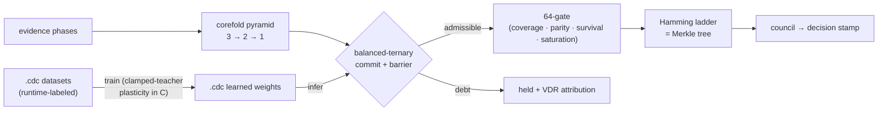

<div align="center">

<picture>
  <source media="(prefers-color-scheme: dark)" srcset="assets/logo-dark.svg">
  
</picture>

# GIST

**Gated Insight Synthesis Topology**

*A reasoning mechanism written in a calculus, verified by its runtime,
and trainable as the neural network it already is.*

[](LICENSE)
[](native/gist.cdc)
[](native/verify_gist.sh)
[](BENCHMARKS.md)
[](https://github.com/ETEllis/bidi-coherence-delta-calculus)

<sub>*The mark is the mechanism: Sierpinski recursion as the network's
convolution filters, the golden trace a signal refracting nonlinearly
through each triangle pass, the quasicrystal twist the facet structure of
the lattice — and the open corner the output aperture (the
balanced-ternary `0`), condensing to one committed point.*</sub>

</div>

---

GIST decomposes a question into a 64-slot lattice (2⁶ = 4³), superposes
evidence as phases, distills each scope's triad to a singular conclusion,
and **commits in balanced ternary** — `+` asserted, `−` opposed, `0` a live
open aperture ("still open, bring evidence" — never *false*) — behind a
barrier that *holds* contradiction-debt with attribution instead of
latching a false conclusion. Everything here is native
[`.cdc`](native): the only non-calculus code in the loop is the vendored
[BiDi micro-bridge](runtime) (one C runtime, one bootloader) — **zero host
code of GIST's own, machine-checked**.

```bash
git clone https://github.com/ETEllis/gist && cd gist
./demo.sh          # 60 seconds: verify -> do() -> train -> evaluate -> judge
./run.sh '+0-'     # one verdict from the natively-trained weights
```

## The demo, verbatim

```console
$ ./demo.sh
1. The mechanism verifies itself (83/83 expectations, host-debt 0):
  83/83 expectations met

2. Pearl's do() runs natively (twin fields: latch + severed channel):
commit=cf-fact-commit module=claim  trits=++++ status=accepted
commit=cf-twin-commit module=claimt trits=+-+0 status=accepted
   # do(r0:=-) dissolved the conclusion to the crossing -> r0 is causal

3. Train the net - in C, from .cdc data, to .cdc weights:
train epoch=0 acc=0.7875 (untrained)
native train ok epochs=10 scenes=400 learned=build/demo_trained.cdc

4. Held-out evaluation (150 unseen scenes):
train epoch=0 acc=0.9333

5. Judge evidence with the trained weights:
   ++-  ->  final verdict: yes
   0+0  ->  final verdict: yes
   -0-  ->  mirror(+0+) -> yes  =>  final verdict: no
   000  ->  final verdict: maybe (open aperture - contribute evidence)
```

Training takes **0.04 s** (400 scenes × 10 epochs), a verdict takes
**2.8 ms** including process spawn, and the full verification gate runs in
**0.15 s** — measured, not estimated: [BENCHMARKS.md](BENCHMARKS.md),
reproduce with `./bench.sh`.

## How it fits together



## What is in this repository

| layer | where | what is proven |
|---|---|---|
| **The mechanism** (native `.cdc`) | [`native/`](native) | kernel contract, 64-lattice over bridge64, synthesis pyramid + veto, Pearl **do()** as latched cell + severed channel (necessity, sufficiency, backdoor, frontdoor — twin fields), the field-as-neural-network forward pass, **native Hebbian learning**, emergent 64-gate, ladder council + decision stamp. `./verify_gist.sh`: **83/83 expectations, 70 witnesses, host-debt 0**. |
| **Native training** (`.cdc` in, `.cdc` out) | [`native/`](native) | `cdc_native_runtime train` — clamp the conclusion at the teacher label (a do()-style latch), let plasticity adapt the weights through ordinary flow. Datasets are **`.cdc`** whose labels the runtime's own converged reduction computed; learned weights are **`.cdc`**. Held-out **0.813 → 0.933**. |
| **The runtime bridge** (vendored, extended) | [`runtime/`](runtime) | BiDi's C runtime + bootloader, extended with plastic channels, `train`, and `infer`. The single "minimal fraction" that is not `.cdc`. |
| **Benchmarks** | [`BENCHMARKS.md`](BENCHMARKS.md) | accuracy vs. majority/untrained/oracle baselines, latency, wall times — all regenerated by `./bench.sh`. |
| **The paper** | [`paper/`](paper) | what GIST is before any neural network, the calculus derivation, the do-operator, native training, the gradient-hybrid reference experiments (0.984 slot / 0.868 verdict / 27/27 parity; construction-tier, code deliberately not shipped), and the LLM training-translation plan. |

## Why "the neural network it already is"

The forward pass **is** the calculus: channels are SO(2) weight blocks,
flow steps are recurrent layers (the Kuramoto turn — a *selective*
nonlinear state-space update arising from phase geometry), commit is the
ternary bottleneck, nest/ladder is the pooling stack. Training is native
too: the runtime's `train` command latches the conclusion cell at the
teacher pole and lets CDC's declared plasticity
(`w += rate·(cos(θ_src−θ_dst) − w)·d`) do the learning **through ordinary
flow**. One substrate — verified, trained, and judging — closed loop.

```bash
cd native && ../runtime/build/cdc_native_runtime \
   train gist_train_net.cdc net gist_scenes_train.cdc 10 my_weights.cdc
../runtime/build/cdc_native_runtime infer my_weights.cdc net '+0-'
```

> **Language-bar note:** GitHub labels `.cdc` as "Cadence" (an unrelated
> language sharing the extension). Every `.cdc` file here is BiDi
> Coherence-Delta Calculus source — the mechanism itself.

## Lineage

GIST is the first CDC-first system: the
[BiDi Coherence-Delta Calculus](https://github.com/ETEllis/bidi-coherence-delta-calculus)
is the substrate and bootstrap — its `cdc_boot.py` and C runtime are the
only non-`.cdc` code in the loop, and the runtime extensions (plasticity,
`train`, `infer`) are slated for upstreaming. If you want to build
CDC-first, start there; this repository is what "starting there" produces.
MIT license throughout.
